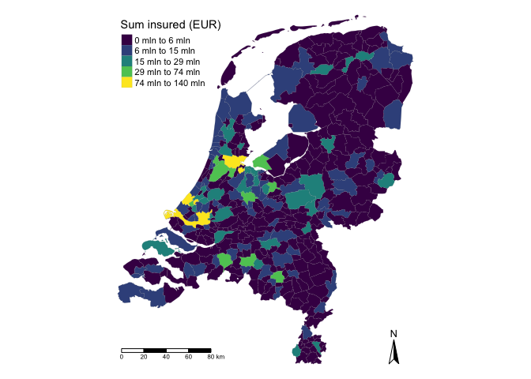

<!-- README.md is generated from README.Rmd. Please edit that file -->

# spatialrisk 

<!-- badges: start -->

[](https://cran.r-project.org/package=spatialrisk)
[](https://cran.rstudio.com/package=spatialrisk)
<!-- badges: end -->

`spatialrisk` is a R-package for spatial risk calculations. It offers an
efficient approach to determine the sum of all observations within a
circle of a certain radius. This might be beneficial for insurers who
are required (by a recent European Commission regulation) to determine
the maximum value of insured fire risk policies of all buildings that
are partly or fully located within a circle of a radius of 200m.

## Installation

Install `spatialrisk` from CRAN:

``` r
install.packages("spatialrisk")
```

Or the development version from GitHub:

``` r
# install.packages("remotes")
remotes::install_github("MHaringa/spatialrisk")
```

## Example 1

Find all observations in `Groningen` within a circle of a radius of 50m
from the point (lon,lat) = (6.561561,53.21326):

``` r
library(spatialrisk)
points_in_circle(Groningen, lon_center = 6.571561, lat_center = 53.21326, radius = 50)
```

    ## # A tibble: 3 x 10
    ##   street   number letter suffix postal_code city     lon   lat amount distance_m
    ##   <chr>     <int> <chr>  <chr>  <chr>       <chr>  <dbl> <dbl>  <dbl>      <dbl>
    ## 1 Heresin…      5 <NA>   <NA>   9711EP      Groni…  6.57  53.2      5       31.4
    ## 2 Heresin…      3 a      <NA>   9711EP      Groni…  6.57  53.2     36       38.1
    ## 3 Heresin…     11 <NA>   <NA>   9711ER      Groni…  6.57  53.2     11       47.8

## Example 2

Find for each row in `df` the sum of all observations in `Groningen`
within a circle of a radius of 100m from the lon/lat pair:

``` r
df <- data.frame(location = c("p1", "p2"), 
                 lon = c(6.561561, 6.561398), 
                 lat = c(53.21369, 53.21326))

concentration(df, Groningen, value = amount, radius = 100)
```

    ##   location      lon      lat concentration
    ## 1       p1 6.561561 53.21369          2055
    ## 2       p2 6.561398 53.21326          2892

## Example 3

`spatialrisk` also contains functionality to create choropleths.
Typically in R it is difficult to create choropleths.
`points_to_polygon()` attempts to elegantly solve this problem.

The common approach is to first aggregate the data on the level of the
regions in the shapefile, and then merging the aggregated data with the
shapefile. Despite it being common, it is problematic in case the names
in the data and the names in the shapefile do not match. This is for
example the case when there are differences in punctuation marks in the
area names. Therefore, `points_to_polygon()` uses the longitude and
latitude of a point to map this point to a region. This approach makes
it easy to create choropleth maps on different region levels.

This example shows how `points_to_polygon()` is used to map the total
sum insured on the municipality level in the
Netherlands:

``` r
gemeente_sf <- points_to_polygon(nl_gemeente, insurance, sum(amount, na.rm = TRUE))
```

`choropleth()` creates a map based on the simple feature object obtained
in the previous step. There are two options to create a choropleth map.
When `mode` is set to `plot` a static map is created. The given
clustering is according to the Fisher-Jenks algorithm. This commonly
used classification method for choropleths seeks to reduce the variance
within classes and maximize the variance between
classes.

``` r
choropleth(gemeente_sf, mode = "plot", legend_title = "Sum insured (EUR)", n = 5)
```

<!-- -->

If `mode` is set to `view` an interactive map is
created:

``` r
choropleth(gemeente_sf, mode = "view", legend_title = "Sum insured (EUR)")
```

<!-- -->

The following simple feature objects are available in `spatialrisk`:
`nl_provincie`, `nl_corop`, `nl_gemeente`, `nl_postcode1`,
`nl_postcode2`, `nl_postcode3`, `nl_postcode4`, `world_countries`, and
`europe_countries`.
